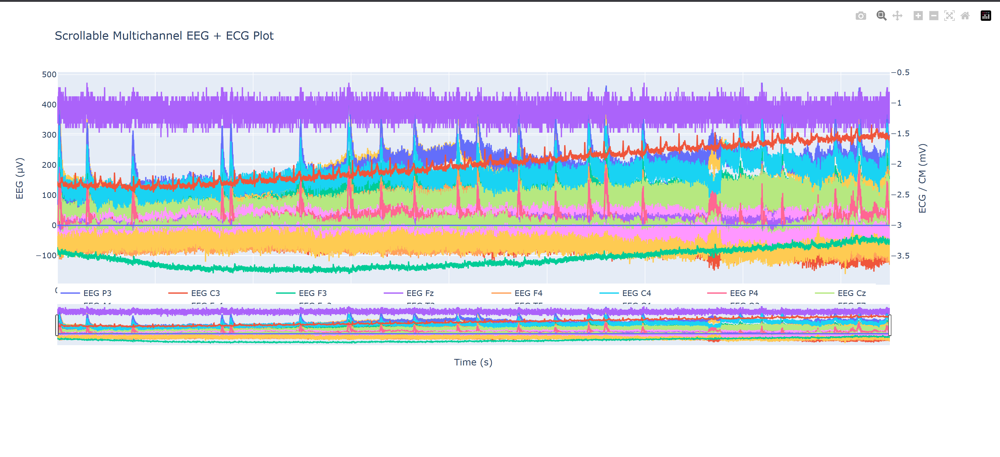

EEG & ECG Visualization Tool
This tool loads EEG/ECG CSV data and provides an interactive Plotly visualization with scrolling, zooming, and exporting options

How to Run:
- Install Python
- Install dependencies (pip install pandas plotly kaleido)
- Run script on Powershell
    - python plot_eeg_ecg.py
- Output:
    - Interactive browser plot
    - eeg_ecg_plot.html (shareable interactive file)  
    - eeg_ecg_plot.png (static export)

Output:

 

Design Choices:
- caling: EEG shown in µV (left y-axis), ECG in mV (right y-axis) to keep both readable.
- Usability: Zoom, scroll, hover tooltips, channel toggling via legend.
- Extras: Automatic export to HTML/PNG.

Use of Ai:
- Suggest usability improvements(channel selection, dual y-axes).
- Provide explanations for use of certain tools in Python
- Organize and clean code

All AI-generated code was reviewed, adapted, and tested before inclusion.

Future Work:
- Automatic export to HTML and PNG
